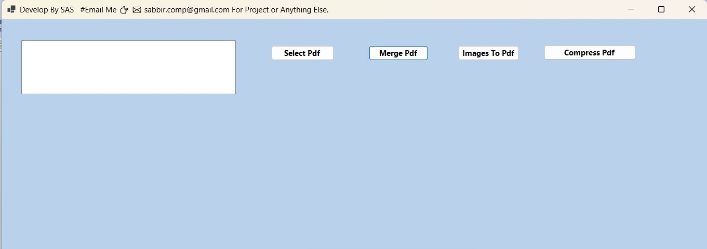

# 📄 PDF Tool – Windows Desktop Application


---

## 📌 Project Overview

PDF Tool is a Windows Desktop Application developed using **.NET and C#** that provides efficient PDF processing capabilities including merging, compression, and image-to-PDF conversion.

This project demonstrates:

- Clean Architecture principles
- Interface-based design
- Facade design pattern
- Separation of concerns
- Scalable and maintainable code structure

---

## 🚀 Key Features

✔ Merge multiple PDF files into a single PDF  
✔ Compress PDF files to reduce size  
✔ Convert JPG images to PDF  
✔ User-friendly Windows Forms interface  
✔ Modular and extensible architecture  

---

## 🛠 Technologies Used

- .NET 5 / .NET Framework
- C#
- Windows Forms
- Ghostscript (for PDF compression)
- Object-Oriented Programming
- Clean Architecture
- Design Patterns (Facade Pattern)

---

## 🏗 Architecture & Design

This application follows a layered architecture:

```
Presentation Layer (WinForms UI)
        ↓
Facade Layer
        ↓
Services Layer
        ↓
Interfaces
```

### Design Principles Applied:

- Dependency Inversion Principle
- Interface Segregation
- Single Responsibility Principle
- Loose Coupling
- Reusable Service Components

---

## 📂 Project Structure

```
PdfProcessor/
│
├── Interfaces/
├── Services/
├── Facade/
├── Forms/
├── PdfProcessor.sln
```

---

## 🖼 Application Screenshots

### Main Dashboard




## ▶ How to Run the Project

1. Clone the repository:

```
git clone https://github.com/sabbiraliseikh892/PDF-Tool-Windows-Desktop-Application
```

2. Open `PdfProcessor.sln` in Visual Studio
3. Build the solution
4. Run the application

---

## 🎯 Why This Project?

This project demonstrates:

- Real-world PDF processing implementation
- Proper layered architecture
- Design pattern usage in desktop applications
- Clean and maintainable enterprise-level coding practices

---

## 👨‍💻 Author

**Sabbir Ali Seikh**  
Full Stack .NET Developer  
7+ Years Experience  

---

## ⭐ If you like this project

Give it a star ⭐ on GitHub!
